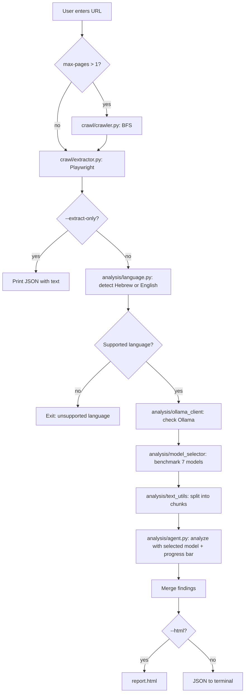

# 🔍 Website Spelling Checker Agent

[GitHub](https://github.com/shlomi10/hebrew-site-proofreader-agent)
[Python](https://www.python.org/)
[Playwright](https://playwright.dev/python/)
[LangChain](https://www.langchain.com/)
[Ollama](https://ollama.com/)
[Hebrew]()
[Privacy]()

An automated agent that accepts a website URL, extracts user-visible text, and checks for spelling errors, grammar issues, and suspicious phrasing — using a **local** language model (Ollama). No site content is sent to external cloud services.

---

## 📑 Table of Contents

- [📋 Overview](#-overview)
- [🏗️ Architecture](#️-architecture)
- [📁 Project Structure](#-project-structure)
- [⚙️ Workflow](#️-workflow)
- [🧰 Technology Choices](#-technology-choices)
- [🌐 Language Detection](#-language-detection)
- [🤖 Model Selection](#-model-selection)
- [📦 Installation](#-installation)
- [🚀 Usage](#-usage)
- [📊 Report Format](#-report-format)
- [🔧 Configuration](#-configuration)
- [⚠️ Limitations and Future Improvements](#️-limitations-and-future-improvements)
- [🛠️ Troubleshooting](#️-troubleshooting)
- [💻 System Requirements](#-system-requirements)
- [👤 Author](#-author)

---

## 📋 Overview

The system supports **Hebrew** and **English** websites. The pipeline:

1. 🌐 User provides a URL.
2. 🎭 **Playwright** opens the page in headless Chromium and extracts only **visible** text (no `script`, no hidden elements).
3. 🔤 **Language detection** identifies Hebrew or English (`langdetect` + script-ratio heuristics). Other languages are rejected with a clear message.
4. 🧪 **Model benchmark** compares 7 candidate models (6+ per language) installed in Ollama and picks the best fit.
5. ✂️ Text is split into chunks (due to model context limits).
6. 🧠 A **LangChain Agent** sends each chunk to the **selected Ollama model** (`localhost:11434`).
7. 📐 The model returns structured findings (JSON / Pydantic).
8. 📄 Results are shown as **JSON** in the terminal or as a styled **HTML report** (RTL, Hebrew labels).

During analysis, progress bars show model benchmarking and chunk-by-chunk analysis in the terminal.

---

## 🏗️ Architecture

```
┌─────────────────────────────────────────────────────────────────┐
│                         main.py (CLI)                           │
│  url, --max-pages, --extract-only, --html, --open, --model      │
└────────────────────────────┬────────────────────────────────────┘
                             │
         ┌───────────────────┼───────────────────┐
         ▼                   ▼                   ▼
┌─────────────────┐  ┌──────────────┐   ┌─────────────────────┐
│  crawl/         │  │  crawl/      │   │  analysis/          │
│  extractor.py   │  │  crawler.py  │   │  ollama_client.py   │
│  Playwright     │  │  BFS crawl   │   │  Ollama health      │
└────────┬────────┘  └──────┬───────┘   └──────────┬──────────┘
         │                  │                      │
         └────────┬─────────┘                      │
                  ▼                                │
         ┌─────────────────┐                       │
         │  analysis/      │                       │
         │  language.py    │                       │
         │  detect he/en   │                       │
         └────────┬────────┘                       │
                  ▼                                │
         ┌───────────────────┐                     │
         │  analysis/        │                     │
         │  model_selector   │                     │
         │  benchmark 7 LLMs │                     │
         └────────┬──────────┘                     │
                  ▼                                │
         ┌─────────────────┐                       │
         │  analysis/      │                       │
         │  text_utils.py  │                       │
         │  chunk split    │                       │
         └────────┬────────┘                       │
                  ▼                                │
         ┌─────────────────┐◄──────────────────────┘
         │  analysis/      │
         │  agent.py       │
         │  LangChain Agent│
         │  + ChatOllama   │
         │  + tqdm progress│
         └────────┬────────┘
                  ▼
         ┌─────────────────┐
         │  analysis/      │
         │  schemas.py     │
         │  TextIssue      │
         │  TextAnalysis   │
         └────────┬────────┘
                  ▼
    ┌─────────────┴─────────────┐
    ▼                           ▼
 stdout (JSON)         reporting/report.py → report.html
```

### 🔄 Flow Diagram (Mermaid)



### 🧩 Separation of Concerns


| Layer          | Badge   | Responsibility                              |
| -------------- | ------- | ------------------------------------------- |
| **Extraction** | extract | Playwright — deterministic, no LLM          |
| **Analysis**   | analyze | LangChain + Ollama — reasoning on text only |
| **Output**     | output  | JSON / HTML — presentation                  |


The agent does **not** open a browser or crawl the web. It receives pre-extracted text and analyzes it. This keeps the design simple, transparent, and easy to debug.

---

## 📁 Project Structure

```
Agent/
├── main.py                 # 🚀 Entry point — CLI
├── config.py               # ⚙️ Global settings
├── crawl/                  # 🎭 Web crawling & text extraction
│   ├── extractor.py        #    Playwright visible text
│   └── crawler.py          #    BFS multi-page crawl
├── analysis/               # 🧠 LLM analysis
│   ├── agent.py            #    LangChain Agent + Ollama
│   ├── language.py         #    Hebrew / English detection
│   ├── model_selector.py   #    7-model benchmark & selection
│   ├── schemas.py          #    Pydantic output models
│   ├── ollama_client.py    #    Ollama health check
│   └── text_utils.py       #    Text chunking
├── reporting/              # 📄 Report generation
│   └── report.py           #    HTML report builder
├── requirements.txt        # 📦 Python dependencies
└── README.md               # 📖 This file
```

---

## ⚙️ Workflow

### 1️⃣ Extraction (Playwright)

`crawl/extractor.py` launches headless Chromium, loads the URL, and runs in-page JavaScript to collect only **visible** text:

- Skips `script`, `style`, `noscript`, `svg`
- Skips elements with `display: none`, `visibility: hidden`, `opacity: 0`
- Normalizes whitespace

### 2️⃣ Crawling (optional)

`crawl/crawler.py` performs BFS within the same domain:

- Page limit (`MAX_PAGES` / `--max-pages`)
- Delay between requests (`CRAWL_DELAY_SECONDS`)
- URL normalization

Default: **single page only**.

### 3️⃣ Language detection

`analysis/language.py` runs after extraction:

1. Computes Hebrew vs. Latin character ratios on the extracted text
2. If one script dominates (≥ 55%), classifies accordingly
3. Otherwise uses `langdetect` on a sample (up to 5,000 chars)
4. Returns language code, name, and confidence


| Result          | Action                                   |
| --------------- | ---------------------------------------- |
| `he` (Hebrew)   | Continue with Hebrew model catalog       |
| `en` (English)  | Continue with English model catalog      |
| Other / unknown | Exit with `Unsupported language` message |


### 4️⃣ Model benchmark & selection

`analysis/model_selector.py` compares **7 candidate models** per language (6+ as required):

1. Lists models installed in Ollama
2. Runs a live proofreading benchmark on a ~400-char sample from the extracted text
3. Scores each installed candidate (see [Scoring formula](#scoring-formula))
4. Prints a comparison table and rationale to stderr
5. Selects the highest-scoring installed model for full analysis

Models not installed appear in the table with a prior-only score and a `not installed` note.

### 5️⃣ Analysis (Agent + Ollama)

`analysis/agent.py`:

1. Splits text into ~800-character chunks (`TEXT_CHUNK_SIZE`)
2. Creates a LangChain Agent with `ChatOllama` using the **selected model**
3. Uses a **language-specific system prompt** (Hebrew or English)
4. Sends each chunk to detect:
  - Spelling errors
  - Grammar issues
  - Suspicious phrasing (phishing tone, excessive urgency, etc.)
5. Receives structured output (`TextAnalysisResult`)
6. Merges findings across chunks and deduplicates
7. Shows a **tqdm progress bar** while processing chunks

### 6️⃣ Report

- **JSON** — default, printed to terminal
- **HTML** — with `--html`, RTL report with tables and color-coded badges

---

## 🧰 Technology Choices


| Technology     | Badge      | Role                | Why                                                    |
| -------------- | ---------- | ------------------- | ------------------------------------------------------ |
| **Playwright** | Playwright | Text extraction     | Renders JavaScript (SPAs), extracts truly visible text |
| **LangChain**  | LangChain  | Agent framework     | Ollama integration, structured Pydantic output         |
| **Ollama**     | Ollama     | Local LLM runtime   | Easy setup, localhost API, no cloud                    |
| **Pydantic**   | Pydantic   | Output schema       | Validates `type`, `original`, `suggestion`, `reason`   |
| **httpx**      | httpx      | Ollama health check | Verifies the local server before analysis              |
| **tqdm**       | tqdm       | Progress bar        | Shows benchmark and analysis progress                  |
| **langdetect** | langdetect | Language detection  | Identifies Hebrew vs. English from extracted text      |


---

## 🌐 Language Detection

Hebrew
English
Other

After Playwright extracts text, `analysis/language.py` determines whether the content is Hebrew or English.

### How it works


| Step | Method       | Details                                                      |
| ---- | ------------ | ------------------------------------------------------------ |
| 1    | Script ratio | Counts Hebrew (U+0590–U+05FF) vs. Latin (A–Z) characters     |
| 2    | Threshold    | If one script ≥ 55% of letters → that language wins          |
| 3    | Fallback     | `langdetect` on up to 5,000 characters with confidence score |
| 4    | Gate         | Only `he` and `en` proceed; all other languages are rejected |


### Unsupported language example

```text
Unsupported language: fr (fr).
This agent supports Hebrew and English only.
```

---

## 🤖 Model Selection

The agent does **not** use a fixed model for every site. After language detection it runs a **scientific comparison** of at least **6 models** (7 in the catalog) and picks the best one for the detected language.

### Candidate models

#### Hebrew catalog (7 models)


| Model                                           | Prior (max 30) | Specialty                        |
| ----------------------------------------------- | -------------- | -------------------------------- |
| DictaLM `aminadaven/dictalm2.0-instruct:q4_k_m` | 30             | Hebrew-specialized LM by Dicta   |
| Llama `llama3.2`                                | 18             | Strong general multilingual      |
| Mistral `mistral`                               | 16             | Efficient European multilingual  |
| Qwen `qwen2.5`                                  | 17             | Strong reasoning, many languages |
| Gemma `gemma2`                                  | 15             | Compact Google model             |
| Phi `phi3`                                      | 12             | Small Microsoft model            |
| Aya `aya`                                       | 14             | Cohere multilingual              |


#### English catalog (7 models)


| Model                  | Prior (max 30) | Specialty                           |
| ---------------------- | -------------- | ----------------------------------- |
| Llama `llama3.2`       | 28             | Top English instruction following   |
| Llama `llama3.1`       | 27             | Large context, excellent English    |
| Mistral `mistral`      | 26             | Speed + English accuracy            |
| Qwen `qwen2.5`         | 27             | High English benchmark scores       |
| Gemma `gemma2`         | 25             | Good English, low VRAM              |
| Phi `phi3`             | 22             | Practical on modest hardware        |
| DeepSeek `deepseek-r1` | 24             | Deep reasoning for complex phrasing |


### Scoring formula

Each **installed** model is benchmarked on a real text sample (~400 chars). Total score is up to **65 points**:


| Component   | Max points | What is measured                            |
| ----------- | ---------- | ------------------------------------------- |
| **Prior**   | 30         | Language fit based on model specialization  |
| **JSON**    | 20         | Valid structured `{"errors": [...]}` output |
| **Latency** | 15         | Response time (faster = higher score)       |


Uninstalled models appear in the table with prior × 0.3 only and `not installed`.

### Why DictaLM for Hebrew?

DictaLM

DictaLM 2.0 Instruct is the **only model trained specifically on Hebrew corpora** (spelling, grammar, phrasing). General models like Llama or Mistral understand Hebrew but are less accurate for proofreading Hebrew websites. The live benchmark confirms this — DictaLM typically wins on Hebrew sites when installed.

```python
OLLAMA_MODEL = "aminadaven/dictalm2.0-instruct:q4_k_m"  # fallback default in config.py
```

### Why Llama 3.2 / Qwen 2.5 for English?

Llama

English sites need models trained on large English datasets with reliable JSON output. DictaLM is Hebrew-specialized and underperforms on English. Llama 3.2 and Qwen 2.5 consistently score highest in the English benchmark.

### Benchmark output (terminal)

```text
Detected language: Hebrew (confidence: 87%)
Running model benchmark (6+ candidates)...
Benchmarking models: 100%|████████| 3/3

שפה שזוהתה: עברית
מודל נבחר: aminadaven/dictalm2.0-instruct:q4_k_m
הסבר: DictaLM 2.0 אומן במיוחד על קורפוס עברי... Benchmark score: 58.2/65 ...

השוואה מדעית (7 מודלים בקטלוג, 3 מותקנים ונבדקו):
מודל                                     מותקן    JSON   זמן      ציון
aminadaven/dictalm2.0-instruct:q4_k_m    כן       כן     8.42     58.2
llama3.2                                 כן       כן     4.15     46.8
mistral                                  לא       לא     0.0      4.8
```

### Install models for full comparison

```powershell
ollama pull aminadaven/dictalm2.0-instruct:q4_k_m
ollama pull llama3.2
ollama pull mistral
ollama pull qwen2.5
ollama pull gemma2
ollama pull phi3
```

Only installed models are benchmarked live. With one model installed, that model is selected automatically.

### Manual override


| Flag               | Behavior                                            |
| ------------------ | --------------------------------------------------- |
| `--model NAME`     | Skip benchmark, use the specified Ollama model      |
| `--skip-benchmark` | Skip benchmark, use `OLLAMA_MODEL` from `config.py` |


**Why a local model?** Site content never leaves the developer machine.

---

## 📦 Installation

### 1️⃣ Python virtual environment

```powershell
cd D:\python-projects\Agent
python -m venv venv
.\venv\Scripts\Activate.ps1
pip install -r requirements.txt
playwright install chromium
```

### 2️⃣ Ollama

Download and install from: [https://ollama.com/download/windows](https://ollama.com/download/windows)

Open a **new terminal** after installation, then:

```powershell
ollama pull aminadaven/dictalm2.0-instruct:q4_k_m
ollama list
```

### 3️⃣ Ollama install locations (optional)

- **Ollama app:** `%LOCALAPPDATA%\Programs\Ollama`
- **Downloaded models:** `%USERPROFILE%\.ollama`

To store models on another drive:

```powershell
setx OLLAMA_MODELS "D:\ollama-models"
```

Restart Ollama after changing this variable.

---

## 🚀 Usage

### Extract text only (no model)

```powershell
python main.py https://ynet.co.il --extract-only
```

### Full analysis — JSON (auto language + model selection)

```powershell
python main.py https://www.gov.il
python main.py https://example.com
```

### Force a specific model (skip benchmark)

```powershell
python main.py https://www.gov.il --model llama3.2
```

### Skip benchmark (use config default)

```powershell
python main.py https://www.gov.il --skip-benchmark
```

### Full analysis — HTML report

```powershell
python main.py https://www.gov.il --html --open
```

### Crawl multiple pages

```powershell
python main.py https://example.co.il --max-pages 5 --html
```

### CLI flags


| Flag               | Badge      | Description                                              |
| ------------------ | ---------- | -------------------------------------------------------- |
| `url`              | required   | Website URL                                              |
| `--extract-only`   | playwright | Playwright only, skip Ollama                             |
| `--max-pages N`    | crawl      | Number of pages to crawl (default: 1)                    |
| `--html [FILE]`    | html       | Save HTML report (default: `report.html`)                |
| `--open`           | open       | Open the HTML report in the browser                      |
| `--model NAME`     | model      | Use a specific Ollama model, skip benchmark              |
| `--skip-benchmark` | skip       | Use `OLLAMA_MODEL` from `config.py` without benchmarking |


---

## 📊 Report Format

### JSON

```json
{
  "language": {
    "code": "he",
    "name": "Hebrew",
    "confidence": 0.87
  },
  "model": "aminadaven/dictalm2.0-instruct:q4_k_m",
  "model_selection": {
    "model": "aminadaven/dictalm2.0-instruct:q4_k_m",
    "language": "he",
    "rationale": "DictaLM 2.0 אומן במיוחד על קורפוס עברי...",
    "candidates_compared": 3,
    "benchmarks": [
      {
        "model": "aminadaven/dictalm2.0-instruct:q4_k_m",
        "catalog_name": "aminadaven/dictalm2.0-instruct:q4_k_m",
        "total_score": 58.2,
        "installed": true,
        "valid_json": true,
        "latency_seconds": 8.42
      }
    ]
  },
  "https://ynet.co.il": {
    "char_count": 70517,
    "issue_count": 2,
    "issues": [
      {
        "type": "spelling",
        "original": "טקסט שגוי",
        "suggestion": "טקסט מתוקן",
        "reason": "שגיאת כתיב"
      },
      {
        "type": "suspicious_phrasing",
        "original": "לחצו עכשיו!!!",
        "suggestion": "",
        "reason": "ניסוח דחיפות חשוד"
      }
    ]
  }
}
```

### Issue types (`type`)


| Badge      | Value                 | Meaning                                                 |
| ---------- | --------------------- | ------------------------------------------------------- |
| spelling   | `spelling`            | Spelling error                                          |
| grammar    | `grammar`             | Grammar / phrasing issue                                |
| suspicious | `suspicious_phrasing` | Suspicious tone (phishing, urgency, unrealistic claims) |


### HTML report

- RTL layout with Hebrew labels
- SVG icons for hero, summary stats, page headers, and table columns
- Color-coded badges with icons per issue type (spelling, grammar, suspicious)
- Summary cards: pages, characters, findings
- Per-page table with styled meta pills
- Generated by `reporting/report.py`

---

## 🔧 Configuration

`config.py`:


| Variable              | Badge  | Default                                 | Description                                  |
| --------------------- | ------ | --------------------------------------- | -------------------------------------------- |
| `OLLAMA_BASE_URL`     | ollama | `http://localhost:11434`                | Ollama server URL                            |
| `OLLAMA_MODEL`        | model  | `aminadaven/dictalm2.0-instruct:q4_k_m` | Fallback model when using `--skip-benchmark` |
| `MAX_PAGES`           | pages  | `20`                                    | Max pages when crawling                      |
| `CRAWL_DELAY_SECONDS` | delay  | `0.5`                                   | Delay between page requests                  |
| `TEXT_CHUNK_SIZE`     | chunk  | `800`                                   | Characters per analysis chunk                |


---

## ⚠️ Limitations and Future Improvements


| Limitation          | Badge | Notes                                                          |
| ------------------- | ----- | -------------------------------------------------------------- |
| **Benchmark time**  | bench | First run benchmarks each installed model (~seconds per model) |
| **Large sites**     | slow  | ynet (~70K chars) = many model calls — slow                    |
| **Accuracy**        | llm   | LLMs can produce false positives or miss errors                |
| **Dynamic content** | js    | Playwright handles JS; complex sites may need longer waits     |


### Possible improvements

- `--max-chars` to cap analyzed text length
- Filter repeated content (nav, footers)
- `robots.txt` check before crawling

---

## 🛠️ Troubleshooting


| Problem                                    | Badge    | Solution                                            |
| ------------------------------------------ | -------- | --------------------------------------------------- |
| `Unsupported language`                     | lang     | Only Hebrew and English sites are supported         |
| `Could not detect language`                | detect   | Page has too little text to classify                |
| `ollama is not recognized`                 | install  | Install Ollama and open a new terminal              |
| `Ollama is not running`                    | start    | Start Ollama from the system tray                   |
| `Model is not installed`                   | pull     | `ollama pull aminadaven/dictalm2.0-instruct:q4_k_m` |
| `pull model manifest: file does not exist` | name     | Wrong model name — use the full name above          |
| `ModuleNotFoundError: langchain`           | pip      | `pip install -r requirements.txt` inside venv       |
| Playwright errors                          | chromium | `playwright install chromium`                       |


---

## 💻 System Requirements

Python
OS
RAM
Network
Analysis

- Python 3.14+
- Windows / macOS / Linux
- Ollama installed and running
- ~4–8 GB RAM (depends on model quantization)
- Internet for crawling the target site (analysis stays local)

---

## 👤 Author

**Shlomi Gross** — built this project as a local AI agent for proofreading Hebrew website content.

[Repository](https://github.com/shlomi10/hebrew-site-proofreader-agent)

**Repository:** [github.com/shlomi10/hebrew-site-proofreader-agent](https://github.com/shlomi10/hebrew-site-proofreader-agent)